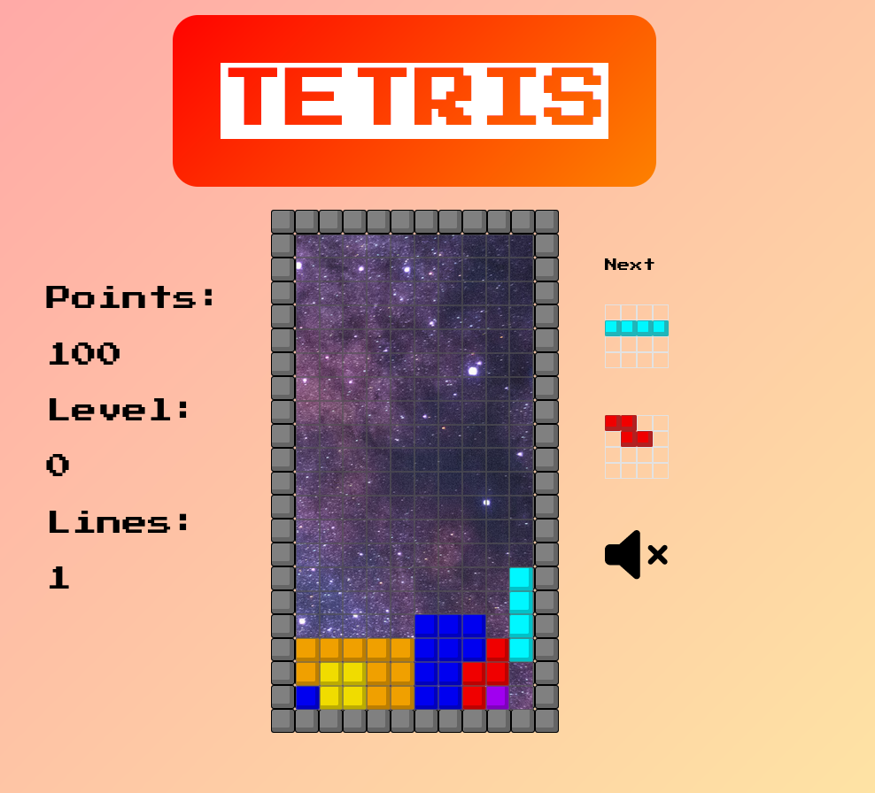

# Tetris - project for Ironhack

[https://romainc75.github.io/IronHack---retroTetris---vanillaJS/]

### About

This Tetris game is fully inspired by the classic Tetris game developped by Alekseï Pajitnov and released in 1984. Like the original, the player controls the tetrominos with the 4 arrows on the keyboard and try to create complete lines to increase the count of the points. The game stops when the new blocks have no more space to go down.

### Gameplay

### Features

The game contains the main features of the Tetris and some others due to the CSS/JS stack:
- removing completed lines with an animation,
- the more the level increases the more the music speeds up
- the more the level increases the more the game speeds up
- music on/off switch,
- score increases depending on : 
  - the number of lines getting erased at the same time
  - the level reached at that time
- being able to slide the moving tetromino on the bottom end and the other tetrominos between 2 clocks
- responsive
- animation on the score number when lines are erased :
  - 1 line : green,
  - 2 lines : blue,
  - 3 lines : orange,
  - 4 lines : red,
- the 2 next pieces are displayed next to the tetris board
- the whole tetris board vibrates when the player make a "tetris" (4 lines at the same time)
- menu/restart
- leaderBoard
- 

